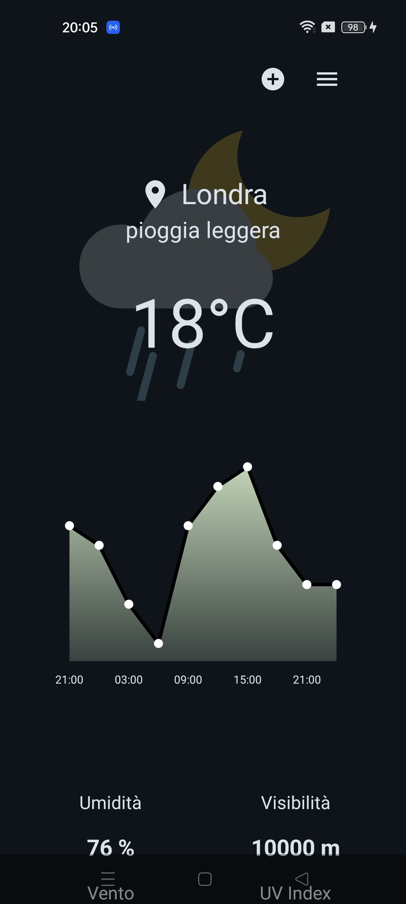
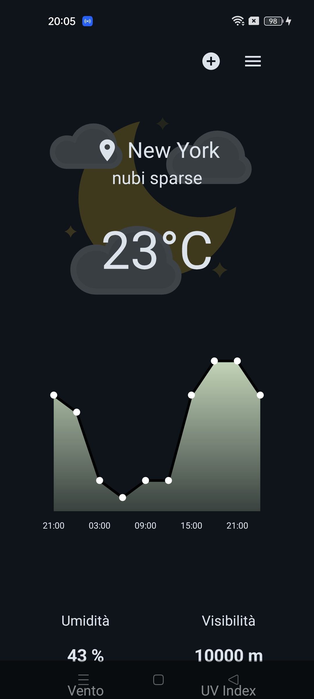
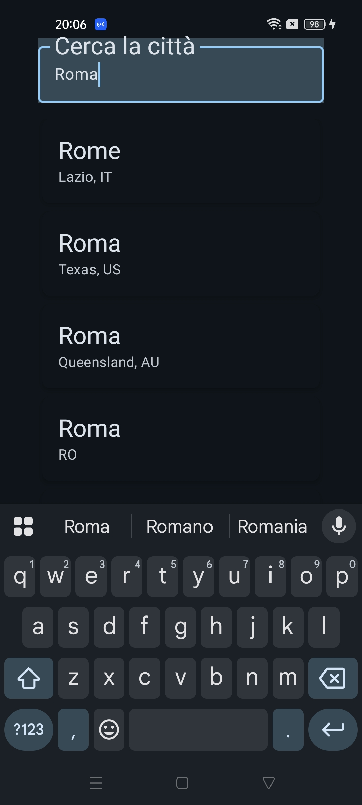

<h1>Weather App</h1>

I made this application from scratch (based on MVVM  pattern) using the official documentation, online videos and some advice from Claude AI

This application is meant for learning and diving into a new environment like Android Studio! I've never programmed in Kotlin and I was also curious about trying jetpack compose

I know that the app is far from finished, in fact I have many features I want to implement in the future, but I think it can be considered at least presentable

<h2>Features</h2>
<ul>
  <li>
Weather Information in a certain place
</li>
  <li>
City Research
</li>
  <li>
Caching for previous data
</li>
  <li>
List of all cities the user has searched
</li>
</ul>

<h2>Supported Versions</h2>

Tested on:

<ul>
  <li>Android API 36 (Virtual Device)</li>
  <li>Android 13 (Physical Device)</li>
</ul>

<h2>Setup Instructions</h2>

If you want to try the application you have to:

<ul>
  <li>
Create an account on <a href="https://openweathermap.org/">OpenWeather</a>
</li>
  <li>
Generate an API key
</li>
  <li>
Create a local.properties file in the root directory of the project
</li>
 <li>
Add your API Key in the local.properties file:

  <pre>
    sdk.dir=C:\\Users\\YourUsername\\AppData\\Local\\Android\\Sdk
    WEATHER_API_KEY=your_api_key_here
  </pre></li>
  <li>
Wait for Gradle sync to complete
</li>
</ul>

"this is only for security matters. In this case the APIs aren't sensitive, but I decided to secure it anyway

<h2>Future Updates</h2>
<ul>
  <li>Better UI in the main page and city search page</li>
  <li>Storing user's past research even when the app is closed</li>
</ul>

<h2>Mentions</h2>
<h3>All the icons I used are available on <a href= "https://lottiefiles.com/">LottieFiles</a></h3>
<h3>Weather data provided by <a href="https://openweathermap.org/">OpenWeatherMap API</a>(free version)</h3>

<h2>Screenshots</h2>

  
  
  
   
  <em>Main Weather Display | City Search | Search Results with History</em>

